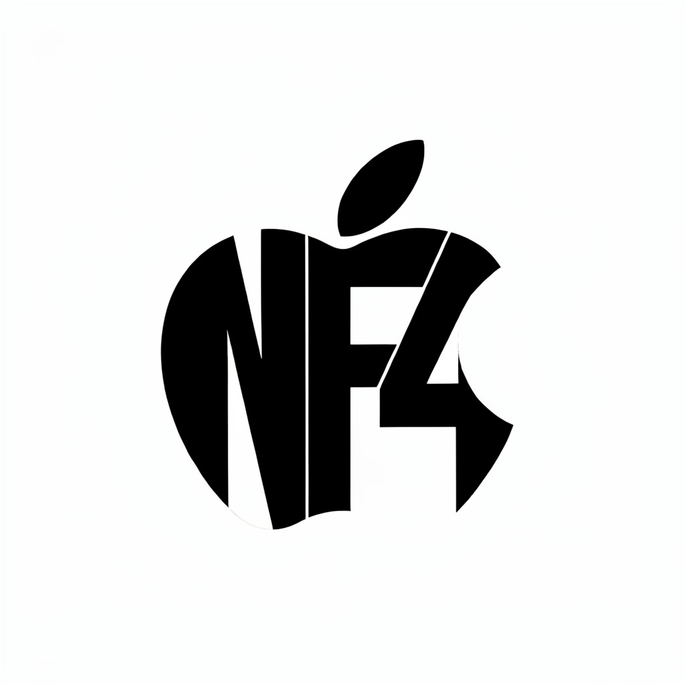

# mlx-ideogram4

Ideogram4's 9.3B transformer and modified Qwen3-VL text encoder, running on Apple Silicon via custom NF4 Metal kernels.

> **Model weights are under the [Ideogram 4 Non-Commercial License](https://huggingface.co/ideogram-ai/ideogram-4-nf4). This repo is a technical demo, not a product.**

<p align="center">

</p>

*"NF4" inside an Apple silhouette — generated at 1024×1024 by Ideogram4 running through custom NF4 Metal kernels on an M4 Max. 13.7 GB peak memory (MLX-reported, sampling only).*

## What is this?

Custom [NF4 (NormalFloat4)](https://arxiv.org/abs/2305.14314) Metal kernels for [MLX](https://github.com/ml-explore/mlx), loading official [bitsandbytes](https://github.com/bitsandbytes-foundation/bitsandbytes) 4-bit weights directly on Apple Silicon. Ideogram4 is the proof — the 9.3B DiT plus the 8.8B modified Qwen3-VL text encoder (18.1B total across three components), all NF4-quantized, generating coherent images with legible rendered text.

The NF4 kernels are model-agnostic linear primitives. Ideogram4 proves they can load official bitsandbytes NF4 weights when paired with model-specific architecture and loader wiring.

## Performance

Same prompt, same seed (2025), same machine (M4 Max 128 GB), uncontended. Memory is MLX-reported peak active memory during sampling (excludes model loading overhead):

<sub>**How memory is measured.** Peak figures come from MLX's own allocator counter, `mlx.core.get_peak_memory()` (bytes of GPU/unified memory at the high-water mark), read at the point noted per number — *sampling-only* for the benchmark tables (counter reset after model load), *full-run including load* for the 16 GB verification below. We report MLX's allocator peak rather than process RSS because RSS undercounts MLX's unified-memory buffers. As an independent cross-check, the 16 GB run was also traced at the system level (`vm_stat` / `vm.swapusage` sampled every 2s) to observe swap/compression behavior; that trace is what backs the "leaned on compression, never swapped" statement, not the memory numbers themselves.</sub>

### 512×512

| Route | Format | Steps | s/step | Sampling | Peak Memory |
|-------|--------|------:|-------:|---------:|------------:|
| **NF4/MLX (this)** | **NF4 4-bit** | 20 | **6.5** | **130s** | **11.5 GB** |
| MFLUX | FP8 8-bit | 20 | 8.9 | 178s | 28.1 GB |

**27% faster, 2.4× less memory.**

### 1024×1024

| Route | Format | Steps | s/step | Sampling | Peak Memory |
|-------|--------|------:|-------:|---------:|------------:|
| **NF4/MLX (this)** | **NF4 4-bit** | 20 | 30.4 | 608s | **13.7 GB** |
| MFLUX | FP8 8-bit | 20 | **25.3** | 505s | 30.6 GB |

**MFLUX is 17% faster per-step, but uses 2.2× more memory.** MFLUX may not fit on a 32 GB Mac at 1024×1024 (peaks at 30.6 GB). NF4/MLX fits comfortably on 16 GB.

### Which Mac can run Ideogram4?

| Mac | NF4/MLX | MFLUX FP8 | GGUF Q4 |
|-----|:-------:|:---------:|:-------:|
| **16 GB** (base MacBook Pro) | **512 ✓** | ✗ | ✗ |
| **24 GB** | **1024 ✓** | ✗ | 512 maybe |
| **32 GB** | **1024 ✓** | 512 ✓, 1024 barely | 512 ✓ |
| **48 GB+** | All ✓ | All ✓ | All ✓ |

**Verified on 16 GB** (M2 Pro MacBook Pro): 512×512 / 20 steps ran to completion
in **9m48s** (21.8s/step — slower than the M4 Max purely from the smaller GPU)
at **11.51 GB** full-run peak (MLX `get_peak_memory()`, including model load —
essentially identical to the sampling-only 11.5 GB measured on the M4 Max, so
load does not blow the budget). A 2-second system-level trace (`vm_stat`) shows
the machine **leaned hard on memory compression — peak ~7.8 GB compressed, free
memory routinely under ~100 MB — but never paged to swap** (swap stayed at 0
throughout). It stayed responsive; the slowdown tracks the GPU gap, not memory
pressure. The M2 Pro's GPU is a step up from the base M-series chip in the
cheapest 16 GB MacBook Pro, but the 16 GB memory ceiling — the thing that gates
whether the model fits at all — is identical.

## Install

Requires macOS on Apple Silicon (M1+) and Python 3.10+.

```bash
# 1. Clone this repo
git clone https://github.com/lyonsno/mlx-ideogram4.git
cd mlx-ideogram4

# 2. Install this package and dependencies FIRST
#    (this pulls mlx-lm/mlx-vlm, which depend on stock MLX)
pip install -e .

# 3. Install MLX with NF4 support LAST so the fork wins
#    (our fork — adds NF4 Metal kernels. Must come after step 2, or
#     mlx-vlm's stock-MLX dependency silently overwrites it and you
#     get `KeyError: 'nf4'` at runtime.)
pip install --force-reinstall --no-deps git+https://github.com/lyonsno/mlx.git@nf4

# 4. Accept the Ideogram4 license and log in to HuggingFace
#    Visit: https://huggingface.co/ideogram-ai/ideogram-4-nf4
#    Then:
huggingface-cli login

# 5. Generate! (first run downloads ~16 GB of model weights)
python generate.py \
  --prompt "a red cat sitting on a blue couch" \
  --output cat.png
```

Or with `uv` (no venv needed):

```bash
git clone https://github.com/lyonsno/mlx-ideogram4.git
cd mlx-ideogram4
# Note: mlx-lm/mlx-vlm pull stock MLX, which can shadow the NF4 fork in the
# resolved environment. If you hit `KeyError: 'nf4'`, fall back to the pip flow
# above (install deps first, then --force-reinstall --no-deps the nf4 fork).
uv run --with "mlx @ git+https://github.com/lyonsno/mlx.git@nf4" \
  --with safetensors --with huggingface_hub --with numpy \
  --with transformers --with pillow --with tqdm --with mlx-lm --with mlx-vlm \
  python generate.py --prompt "a red cat sitting on a blue couch" --output cat.png
```

### Gradio UI

```bash
pip install gradio
python app.py              # local UI at http://127.0.0.1:7860
python app.py --share      # public URL (tunneled through Gradio)
```

### Presets

```bash
python generate.py --prompt "your prompt" --preset V4_TURBO_12    # fast preview
python generate.py --prompt "your prompt" --preset V4_DEFAULT_20  # good balance (default)
python generate.py --prompt "your prompt" --preset V4_QUALITY_48  # highest quality
```

## Architecture

Three NF4-quantized model components:

| Component | Params | NF4 Layers | Memory |
|-----------|-------:|-----------:|-------:|
| Text encoder (Qwen3-VL-8B, modified) | 8.8B | 368 | 5.5 GB |
| Conditional transformer (34-layer DiT) | 9.3B | 211 | 5.2 GB |
| Unconditional transformer | 9.3B | 211 | 5.2 GB |
| VAE (Flux2 KL-VAE) | 45M | 0 | 168 MB |

Pipeline: tokenize → Qwen3-VL hidden state extraction (13 layers) → Euler flow-matching with asymmetric CFG → Flux2 VAE decode.

## NF4 Metal kernels

The core contribution is NF4 quantization for MLX:

- **16-element LUT** derived from normal distribution quantiles (QLoRA)
- **Scaled LUT optimization**: precompute `lut[i] × absmax` per group, eliminating one multiply from the inner loop
- **Full kernel family**: QMV (token gen), QVM, QMM (prefill), split-K, all instantiated across float/bfloat16/float16 × group sizes 32/64/128
- **`mx.quantize/dequantize/quantized_matmul(mode='nf4')`** + **`nn.QuantizedLinear(mode='nf4')`**
- **bitsandbytes weight loader**: reads NF4 safetensors directly, repacks nibbles to MLX uint32 format

## How it was built

One session (2026-06-10 to 2026-06-11):

1. NF4 Metal kernel family from scratch (~900 lines)
2. C++ dispatch + Python API integration (9 MLX core files)
3. bitsandbytes NF4 safetensors weight loader
4. Ideogram4 9.3B transformer port (34 layers, MRoPE, AdaLN, SwiGLU)
5. Qwen3-VL 8.8B text encoder via mlx-vlm (discovered custom deepstack modules)
6. Flux2 VAE decoder
7. Pipeline with Euler flow-matching, logit-normal schedule, asymmetric CFG
8. Profiling + scaled LUT optimization
9. Three independent code reviews (kernels, weight loader, architecture parity)

## Credits

- [Ideogram](https://ideogram.ai) for the model and weights (non-commercial license)
- [MLX](https://github.com/ml-explore/mlx) by Apple
- [MFLUX](https://github.com/filipstrand/mflux) for prior FP8 Ideogram4 on MLX
- [stable-diffusion.cpp](https://github.com/leejet/stable-diffusion.cpp) and GGUF quantization work
- [bitsandbytes](https://github.com/bitsandbytes-foundation/bitsandbytes) for the NF4 format
- [mlx-vlm](https://github.com/Blaizzy/mlx-vlm) for Qwen3-VL architecture

## License

Code: MIT. Model weights: [Ideogram 4 Non-Commercial License](https://huggingface.co/ideogram-ai/ideogram-4-nf4).
